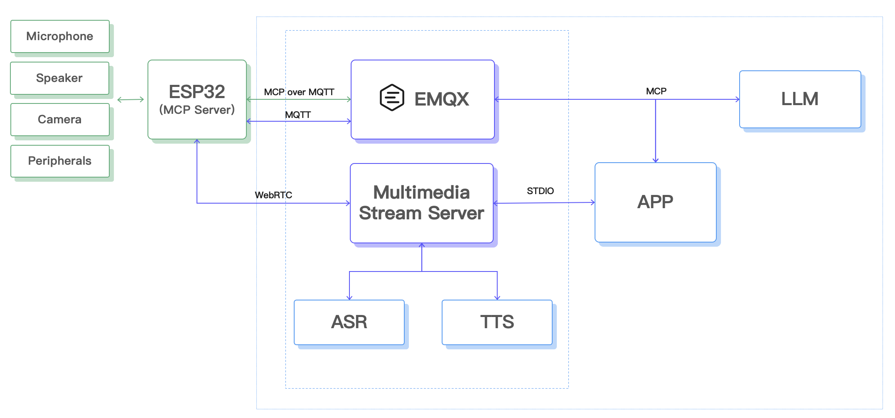

[English](README.md) | [简体中文](README-CN.md)
## **AI + IoT 的具象化：真正“懂你”的情感陪伴智能体**

这是系列文章「ESP32 + MCP over MQTT：从 0 到 1 打造情感陪伴智能体」的代码库。

智能硬件的发展经历了几个阶段：从最初的“能联网”，到后来“能听你说话”，再到今天，我们希望它不仅能理解你的话，还能回应你，甚至陪伴你。想象以下的几个场景：

- 下班回家，它主动问候你：“今天看起来有点疲惫，要不要帮你调暗灯光，放点轻音乐？”
- 孩子和它聊天，它能用不同角色的声音演绎小故事。
- 打开摄像头，它看看你的穿搭，并幽默回应：“今天这身很有气质！”

这并非只存在于科幻作品中，而是大模型（LLM）+ 多模态 AI + IoT 技术结合的必然趋势。

传统 IoT 设备大多依赖“命令式控制”，即系统通过硬编码或者预置规则的方式来对设备进行控制，无法智能感知设备状态的变化。而未来的设备将迈向语义交互和情感陪伴。情感陪伴智能体，正是这一趋势的缩影。

### **该系列文章适合谁？**

如果你符合以下任意一种特征，这个系列就是为你准备的：

- 智能硬件开发工程师：想探索 AI 如何赋能 IoT
- 嵌入式/物联网开发者：对接 AI 服务，实现语音、视觉交互
- 硬件发烧友 / 创客：想 DIY 一个“有灵魂”的智能小助手
- AI 应用开发者：希望从云端走向硬件，打通端到端体验

如果你曾经做过智能家居、机器人、AI 助手项目，这个系列能帮你提升到一个全新的交互层级。

### **背景知识要求**

别担心，你不需要成为全栈大神，但以下知识会让你更轻松：

- 硬件开发基础：会烧写 ESP32 程序（ESP-IDF）
- 网络通信基础：了解 MQTT 协议的基本概念（发布/订阅）
- Python 基础：后续 LLM 和云端应用用到 Python SDK
- AI 应用概念（选修）：知道什么是大语言模型（LLM）、ASR（语音识别）、TTS（语音合成）

不会这些也没关系，系列文章会逐步讲解，并提供开箱即用的示例。

### **为什么要自己做？**

- 商用产品封闭无法定制，而我们希望用最经济、最简单的方式，构建一个功能强大的情感陪伴智能体
- 借助开源硬件（ESP32）+ 云端 AI 接口，个人开发者也能打造接近厂商级体验的智能体
- 这个过程不仅能让你玩出酷炫的 AI 硬件，还能深入理解 AI + IoT 的架构设计与实践

### **本系列教程的目标**

通过渐进式教程，带你从零搭建一个情感陪伴智能体，它将具备：

- 语音交互：听懂你的话，并用自然语气回答
- 设备控制：通过语义指令调节屏幕亮度、音量等
- 个性化人格：设定性格、喜好，具备一定记忆能力
- 视觉理解：识别图像内容，并生成趣味反馈

最终，你将实现这样的体验：

- “嘿，把屏幕调暗一点” → *“好的，已经帮你调暗，舒服点了吧？”*
- “你看一下我，觉得怎么样？” → 智能体拍摄照片并上传 → *“呦，今天这么好看，是想迷死谁啊？”*

### **本系列教程路线图**

| 篇章 | 功能                                                   | 难度 |
| :--- | :----------------------------------------------------- | :--- |
| 1    | 整体介绍：背景 + 环境准备 + 设备上线                   | ★    |
| 2    | 从“命令式控制”到“语义控制”：MCP over MQTT 封装设备能力 | ★★   |
| 3    | 接入 LLM，实现“自然语言 → 设备控制”                    | ★★   |
| 4    | 语音 I/O：麦克风数据上传 + 语音识别 + 语音合成回放     | ★★★  |
| 5    | 人格、情感、记忆：从“控制器”到“陪伴体”                 | ★★★  |
| 6    | 给智能体增加“眼睛”：图像采集 + 多模态理解              | ★★★  |

## **技术栈一览**

- ESP32：低成本 + Wi-Fi/Bluetooth + 丰富外设，智能硬件项目首选
- MQTT 协议：轻量、实时、跨平台，IoT 标配
- MCP (Model Context Protocol) Over MQTT
  - 让 LLM 通过“工具调用”直接控制硬件
  - 设备服务以“能力声明”方式注册，AI 调用自然、标准
- AI 能力：
  - LLM：处理自然语言、控制意图
  - ASR/TTS：语音识别与合成
  - VLM（多模态大模型）：视觉理解，生成有趣描述
- 云端服务：
  - EMQX Serverless，或者本地安装的 EMQX
  - 开源 AI 框架：LangChain / LangFlow / LlamaIndex，本文选择的是 LlamaIndex

一句话概括架构：ESP32 做“硬件执行器”，云端 AI 做“大脑”，MQTT + MCP 做“神经通路”。

## **硬件清单**

为完成本教程所有相关的功能，推荐准备以下硬件：

- ESP32-S3-DevKitC（熟悉开发版的可以选择其他型号）
- INMP441 麦克风模块
- 功放 MAX98357A
- 喇叭 2-3W
- IIC 接口的液晶显示器
- OV2640 摄像头模块
- 400 孔面包板以及杜邦线一套

## **总体系统架构设计**

- 硬件层：ESP32 + 麦克风 + 扬声器 + 摄像头 + 屏幕。
- 连接层：MQTT Broker（EMQX） + MCP 协议。
- AI 服务层：自然语言处理、语音合成、视觉识别、人格逻辑

AI 服务方面，本文选择了阿里云的语音识别，语音合成，大模型以及多模态大模型的服务。